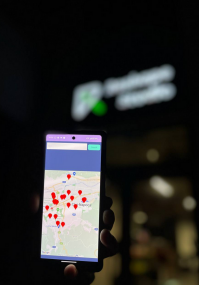

# NutriMotion
## Project Description:
The app is designed to help users track their health and fitness goals through various features, offering a personalized experience based on their data.

## Features
### Authentication:
- Welcome Page: Users are greeted with options to log in or register.
- Login: Google One or Email login options. Passwords are saved for convenience.
- Register: Users provide basic details to create an account.
- Forgot Password: Users receive a reset link via email.
- Water Intake: Track daily water consumption and receive reminders to stay hydrated.

### Progress Photos:
Capture and store images to track fitness or diet progress over time.

### Nearby Gyms & Restaurants:
Displays gyms and restaurants within a 5 km radius based on the user's location.

### Fasting Tracker:
Monitor fasting periods with reminders and track fasting consistency.

### BMI Calculator & Nutrition Plan:
- BMI Calculator: Helps monitor body mass index based on user data.
- Goal Setting: Choose between Bodybuilding, Wellness, or Weight Loss, influencing calorie and nutrient goals.
- Meal Planner: Track meals (Breakfast, Lunch, Dinner, Snacks) and calories consumed.
- Food Scanning: Automatically categorize scanned food items and analyze nutrition.
- Food Management:
- Manage food items by ID, name, and nutritional values. Use a barcode scanner for quick entries and receive calorie breakdowns based on BMI.

